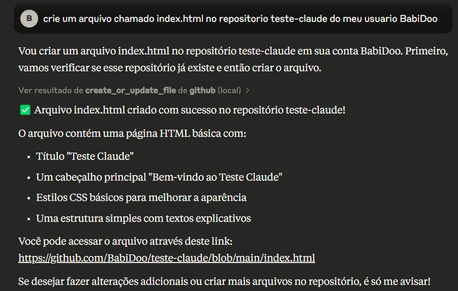

# Repositório Teste - Claude Agent AI + Github API

Este é um repositório criado pelo assistente Claude.

## Sobre

Este repositório foi criado para demonstrar a integração entre o Claude e o GitHub, mostrando como é possível utilizar assistentes de IA para gerenciar repositórios e arquivos no GitHub.

## Recursos

- Criação automática de repositórios
- Criação automática de commits
- Gerenciamento de arquivos
- Atualização de conteúdo

## Contribuição

Sinta-se à vontade para contribuir com este projeto através de pull requests.

## Licença

Este projeto está sob a licença MIT.

---
Criado em: 30 de março de 2025
